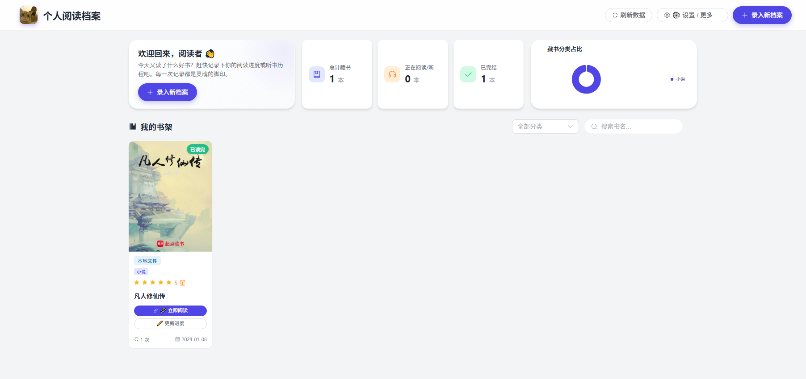
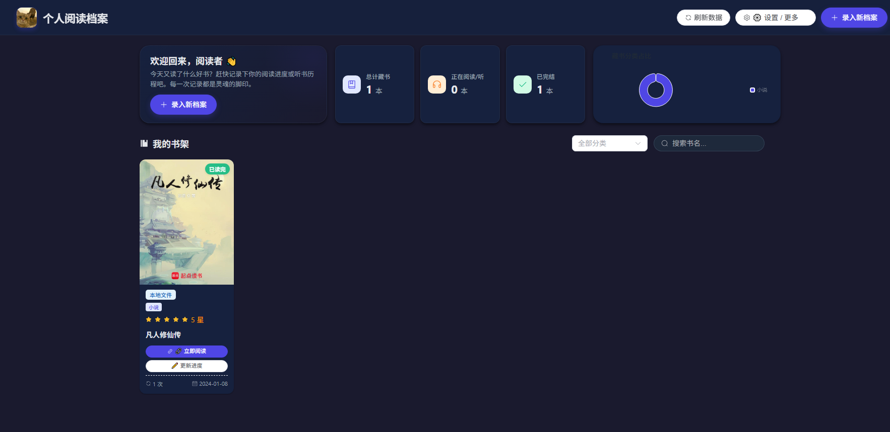
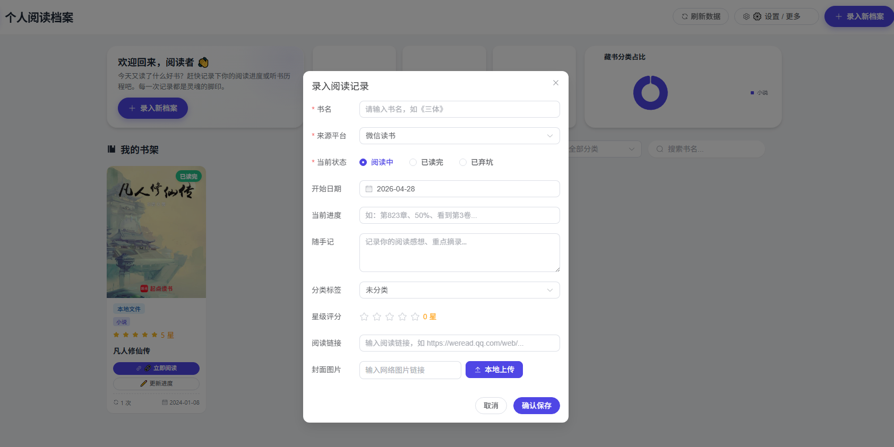

# 📚 个人阅读档案系统

> 一个功能完善的个人阅读/听书记录管理系统，支持书籍录入、阅读追踪、数据统计与可视化。


---

## 📋 目录

- [项目概述](#-项目概述)
- [系统预览](#-系统预览)
- [功能一览](#-功能一览)
- [技术栈](#-技术栈)
- [快速开始](#-快速开始)
- [项目结构](#-项目结构)
- [数据模型](#-数据模型)
- [API 接口](#-api-接口)
- [开发指南](#-开发指南)
- [部署指南](#-部署指南)
- [常见问题](#-常见问题)
- [更新日志](#-更新日志)
- [许可证](#-许可证)

---

## 📖 项目概述

**个人阅读档案系统**是一个用于记录和管理个人阅读/听书历史的 Web 应用。它帮助你：

- 📝 **记录**每一本书的阅读历程，包括平台、状态、进度和感想
- 📊 **可视化**阅读数据，直观了解自己的阅读偏好和习惯
- 🔒 **安全保护**，密码锁确保你的阅读隐私
- 🌙 **夜间模式**，深夜阅读也不刺眼
- 💾 **数据备份**，一键导入导出，数据永不丢失
- 🎨 **自定义系统**，可自定义系统名称、欢迎语和图标

无论你是重度阅读者、听书爱好者，还是想要培养阅读习惯的初学者，这个系统都能帮你更好地管理阅读生活。

---

## 📸 系统预览



| 暗黑模式界面 | 录入数据界面 |
|:---:|:---:|
|  |  |

---

## ✨ 功能一览

### 📚 书籍管理

| 功能 | 说明 |
|------|------|
| **书籍录入** | 支持录入新书，包含书名、封面图片、来源平台等信息 |
| **智能查重** | 录入时自动检查是否已存在，避免重复录入；已存在的书籍可追加新的阅读记录 |
| **书籍编辑** | 支持修改已有书籍的书名、封面、分类、评分和阅读链接 |
| **直达阅读链接** | 可为书籍关联外部阅读链接（如微信读书链接），卡片上提供「立即阅读」快捷按钮 |
| **封面图片管理** | 支持输入网络图片链接或本地上传封面图片（自动生成唯一文件名，限制 5MB，仅图片格式），上传后实时预览封面效果 |

### 📖 阅读记录管理

| 功能 | 说明 |
|------|------|
| **阅读记录录入** | 每本书可以有多条阅读记录，记录阅读平台、状态和开始日期 |
| **阅读进度追踪** | 每条阅读记录可记录当前进度（如「第823章」「50%」「看到第3卷」），支持从书架卡片快捷更新进度 |
| **随手记功能** | 每条阅读记录可添加文本备注，记录阅读感想、重点摘录等，在时间轴中以独立卡片展示 |
| **时间轴展示** | 点击书籍可查看其完整的阅读历史时间轴，按时间倒序排列 |
| **编辑阅读记录** | 在时间轴中可直接编辑单条阅读记录的平台、状态、日期、进度和备注 |
| **阅读记录删除** | 支持删除单条阅读记录，当一本书的所有记录都被删除时，书籍也会被自动删除（同时清理孤儿封面图片） |

### 🔒 安全与隐私

| 功能 | 说明 |
|------|------|
| **密码锁保护** | 全屏密码验证层，所有 API 请求均需携带 `X-Auth-Token` 请求头，支持退出锁定 |
| **密码持久化** | 验证成功后密码保存在浏览器 localStorage 中，刷新页面无需重复输入 |
| **401 自动拦截** | Axios 全局响应拦截器捕获 401 错误，自动清除密码并跳转到密码锁页面 |
| **密码修改** | 支持在应用内修改访问密码，旧密码验证通过后更新为新密码 |

### 🏷️ 分类与评分

| 功能 | 说明 |
|------|------|
| **分类管理** | 支持创建、删除自定义分类，书籍录入和编辑时可选择分类 |
| **分类筛选** | 书架支持按分类筛选，快速定位特定分类的书籍 |
| **星级评分** | 支持 0-5 星评分，在书架卡片和时间轴中展示 |

### 📊 数据统计与可视化

| 功能 | 说明 |
|------|------|
| **数据统计** | 展示总存书数量、正在阅读/听数量和已完结数量 |
| **分类占比饼图** | 使用 ECharts 渲染藏书分类占比环形图，直观展示阅读偏好 |
| **搜索过滤** | 支持按书名模糊搜索，快速定位书籍 |

### 🎨 用户体验

| 功能 | 说明 |
|------|------|
| **平台标签美化** | 不同来源平台（微信读书、喜马拉雅、本地文件、实体书等）使用不同颜色标识 |
| **响应式设计** | 适配不同屏幕尺寸的设备，从手机到桌面均有良好体验 |
| **现代化 UI** | 毛玻璃导航栏、渐变背景、悬浮动画、卡片式布局 |
| **夜间模式** | 支持一键切换深色/浅色主题，偏好设置持久化到 localStorage |

### ⚙️ 系统自定义

| 功能 | 说明 |
|------|------|
| **自定义系统名称** | 可在「系统设置」中修改应用名称，导航栏和页面标题同步更新 |
| **自定义欢迎语** | 支持自定义首页欢迎标题和副标题 |
| **自定义系统图标** | 支持上传或输入图片链接作为导航栏图标 |

### 💾 数据管理

| 功能 | 说明 |
|------|------|
| **数据持久化** | 使用 SQLite 数据库存储数据，确保数据安全 |
| **数据导出** | 一键导出所有书籍和阅读记录为 JSON 格式备份文件 |
| **数据导入** | 支持导入 JSON 格式备份文件，自动跳过书名重复的书籍，自动创建缺失的分类 |
| **数据库自动迁移** | 启动时自动检测旧表结构并添加缺失列，确保版本升级无忧 |
| **默认分类初始化** | 首次运行时自动创建默认分类（小说、历史、科技、哲学、心理学、经济管理、个人成长、其他） |

---

## 🛠 技术栈

### 后端

| 技术 | 用途 | 版本 |
|------|------|------|
| [FastAPI](https://fastapi.tiangolo.com/) | Web 框架 | 0.104.1 |
| [SQLAlchemy](https://www.sqlalchemy.org/) | ORM 数据库操作 | 2.0.23 |
| [SQLite](https://www.sqlite.org/) | 数据库引擎 | 内置 |
| [Pydantic](https://docs.pydantic.dev/) | 数据验证 | 2.5.0 |
| [Uvicorn](https://www.uvicorn.org/) | ASGI 服务器 | 0.24.0 |
| [python-multipart](https://github.com/andrew-d/python-multipart) | 文件上传支持 | 0.0.6 |
| [python-dotenv](https://github.com/theskumar/python-dotenv) | 环境变量加载 | 1.0.0 |

### 前端

| 技术 | 用途 | 版本 |
|------|------|------|
| [Vue 3](https://vuejs.org/) | 前端框架（Composition API） | 3.x |
| [Element Plus](https://element-plus.org/) | UI 组件库 | 最新 |
| [Axios](https://axios-http.com/) | HTTP 客户端 | 最新 |
| [ECharts](https://echarts.apache.org/) | 数据可视化图表 | 5.x |

### 部署

| 技术 | 用途 |
|------|------|
| [Docker](https://www.docker.com/) | 容器化部署 |
| [Docker Compose](https://docs.docker.com/compose/) | 容器编排 |

---

## 🚀 快速开始

### 本地运行

#### 前置要求

- Python 3.7 或更高版本
- pip 包管理工具

#### 安装步骤

1. **克隆项目**
   ```bash
   git clone <项目仓库地址>
   cd my-reading-tracker
   ```

2. **（可选）创建虚拟环境**
   ```bash
   # Windows
   python -m venv venv
   venv\Scripts\activate

   # Linux/Mac
   python3 -m venv venv
   source venv/bin/activate
   ```

3. **安装依赖**
   ```bash
   pip install -r requirements.txt
   ```

4. **启动后端服务**
   ```bash
   uvicorn main:app --host 0.0.0.0 --port 8000
   ```

5. **访问应用**
   打开浏览器，访问 `http://localhost:8000`

6. **输入访问密码**
   默认密码为 `123456`，可在应用内「修改访问密码」功能中更改

### Docker 运行

#### 前置要求

- Docker
- Docker Compose

#### 安装步骤

1. **克隆项目**
   ```bash
   git clone <项目仓库地址>
   cd my-reading-tracker
   ```

2. **构建并启动容器**
   ```bash
   docker-compose up -d
   ```

3. **访问应用**
   打开浏览器，访问 `http://localhost:8000`

> 详细部署说明请参阅 [`DEPLOYMENT.md`](DEPLOYMENT.md)。

---

## 📁 项目结构

```
my-reading-tracker/
├── main.py                  # 后端主文件，包含 API 接口定义和数据库模型
├── index.html               # 前端页面（Vue 3 单页应用，含全部前端逻辑）
├── requirements.txt         # 后端依赖
├── Dockerfile               # Docker 构建文件
├── docker-compose.yml       # Docker Compose 配置文件
├── .env                     # 环境变量配置文件（可选，需自行创建）
├── README.md                # 项目说明文档（本文件）
├── DEPLOYMENT.md            # 部署说明文档
├── data/                    # 数据库文件存储目录（自动创建）
│   ├── books.db             # SQLite 数据库文件
│   └── covers/              # 上传的封面图片存储目录
├── plans/                   # 项目规划文档
│   └── ux-upgrade-plan.md   # UX 升级计划
└── test_export.json         # 导出备份示例文件
```

---

## 💾 数据模型

### 分类表 (Categories)

| 字段 | 类型 | 说明 |
|------|------|------|
| `id` | Integer (PK) | 主键，自增 |
| `name` | String (Unique) | 分类名称，唯一 |
| `created_at` | DateTime | 创建时间 |

### 书籍表 (Books)

| 字段 | 类型 | 说明 |
|------|------|------|
| `id` | Integer (PK) | 主键，自增 |
| `title` | String (Unique) | 书名，唯一 |
| `cover` | String (Nullable) | 封面图片 URL 或本地路径 |
| `category` | String | 分类标签（默认"未分类"） |
| `rating` | Integer | 星级评分（0-5） |
| `read_url` | String (Nullable) | 直达阅读链接 |
| `created_at` | DateTime | 首次录入时间 |

### 阅读记录表 (Reading_Logs)

| 字段 | 类型 | 说明 |
|------|------|------|
| `id` | Integer (PK) | 主键，自增 |
| `book_id` | Integer (FK) | 外键，关联书籍表 |
| `platform` | String | 来源平台（微信读书、喜马拉雅、本地文件、实体书、其他） |
| `status` | String | 状态（阅读中、已读完、已弃坑） |
| `start_date` | DateTime | 开始日期 |
| `progress` | String (Nullable) | 当前进度（如"第823章"、"50%"） |
| `notes` | String (Nullable) | 随手记（文本备注） |

### 系统配置表 (System_Config)

| 字段 | 类型 | 说明 |
|------|------|------|
| `id` | Integer (PK) | 主键，自增 |
| `key` | String (Unique) | 配置键名（如 `admin_password`、`site_name`、`welcome_title` 等） |
| `value` | String | 配置值（密码等敏感信息以 SHA-256 哈希存储） |

---

## 🔌 API 接口

### 书籍接口

| 方法 | 路径 | 说明 |
|------|------|------|
| `GET` | `/` | 返回前端主页 [`index.html`](index.html) |
| `GET` | `/api/books/` | 获取所有书籍列表，包含阅读统计信息 |
| `GET` | `/api/books/check?title=书名` | 检查书籍是否已存在（智能查重） |
| `POST` | `/api/books/` | 录入新书（同时创建第一条阅读记录） |
| `PUT` | `/api/books/{book_id}` | 更新指定书籍的信息（书名、封面、分类、评分、阅读链接） |
| `GET` | `/api/books/{book_id}/logs` | 获取指定书籍的所有阅读记录 |
| `POST` | `/api/books/{book_id}/logs` | 为已有书籍添加新的阅读记录 |

### 阅读记录接口

| 方法 | 路径 | 说明 |
|------|------|------|
| `PUT` | `/api/logs/{log_id}` | 更新指定阅读记录（平台、状态、日期、进度、备注） |
| `PATCH` | `/api/logs/{log_id}/progress` | 快速更新阅读进度（仅需 progress 字段） |
| `DELETE` | `/api/logs/{log_id}` | 删除指定阅读记录（若书籍无其他记录则自动删除书籍） |

### 分类管理接口

| 方法 | 路径 | 说明 |
|------|------|------|
| `GET` | `/api/categories/` | 获取所有分类列表 |
| `POST` | `/api/categories/` | 创建新分类 |
| `DELETE` | `/api/categories/{category_id}` | 删除指定分类 |

### 封面上传接口

| 方法 | 路径 | 说明 |
|------|------|------|
| `POST` | `/api/upload/cover` | 上传封面图片，返回可访问的 URL |

### 数据备份接口

| 方法 | 路径 | 说明 |
|------|------|------|
| `GET` | `/api/export` | 导出所有书籍和阅读记录为 JSON |
| `POST` | `/api/import` | 导入 JSON 格式的备份数据 |

### 系统设置接口

| 方法 | 路径 | 说明 |
|------|------|------|
| `GET` | `/api/settings/` | 获取所有系统设置（站点名称、欢迎语、图标等） |
| `POST` | `/api/settings/` | 更新系统设置 |
| `POST` | `/api/settings/change-password` | 修改管理员访问密码 |

### 认证说明

所有 `/api/` 开头的请求需要在请求头中携带 `X-Auth-Token` 字段，值为后端配置的访问密码。未携带或密码错误将返回 401 状态码。

> 详细的 API 请求/响应示例请参阅 [`DEPLOYMENT.md`](DEPLOYMENT.md#4-api-接口列表)。

---

## 🧑‍💻 开发指南

### 开发环境搭建

1. **克隆项目并安装依赖**（参考[快速开始](#-快速开始)）
2. **启动开发服务器**
   ```bash
   uvicorn main:app --host 0.0.0.0 --port 8000 --reload
   ```
   `--reload` 参数启用热重载，代码修改后自动重启服务。

3. **前端开发**
   前端代码全部在 [`index.html`](index.html) 中，使用 Vue 3 Composition API。修改后刷新浏览器即可看到效果。

### 代码风格

- **后端**：遵循 PEP 8 规范，使用类型注解
- **前端**：使用 Vue 3 Composition API (`setup()` 语法)
- **注释**：关键逻辑处添加中文注释说明

### 数据库迁移

系统在启动时自动执行数据库迁移（[`main.py`](main.py:88) 中的 `upgrade_database()` 函数），无需手动执行迁移脚本。如需新增字段，在对应的模型类中添加字段定义，并在 `upgrade_database()` 中添加对应的 ALTER TABLE 语句。

### 添加新功能

1. **后端**：在 [`main.py`](main.py) 中定义新的 Pydantic 模型和 API 路由
2. **前端**：在 [`index.html`](index.html) 的 Vue 组件中添加对应的 UI 和交互逻辑
3. **数据库**：如需新增表，在 [`main.py`](main.py) 中定义新的 SQLAlchemy 模型类

### 环境变量配置

创建 `.env` 文件（与 [`main.py`](main.py) 同级）：
```env
# 允许跨域访问的域名列表（逗号分隔）
ALLOWED_ORIGINS=http://localhost:8000,http://127.0.0.1:8000
```

系统启动时会自动通过 `python-dotenv` 加载 `.env` 文件中的配置。

---

## 📦 部署指南

详细的部署说明（包括本地部署、Docker 部署、生产环境建议、故障排查等）请参阅 [`DEPLOYMENT.md`](DEPLOYMENT.md)。

---

## ❓ 常见问题

### Q: 忘记访问密码怎么办？

直接打开 [`main.py`](main.py) 文件，查看 `ADMIN_PASSWORD` 变量的值（默认 `123456`）。如果密码已通过应用内修改功能更改过，密码以 SHA-256 哈希形式存储在 [`data/books.db`](data/books.db) 数据库的 `system_config` 表中，可以删除数据库文件重新启动以重置为默认密码。

### Q: 如何备份数据？

推荐两种方式：
1. **应用内备份**：点击「⚙️ 设置 / 更多 → 导出备份」下载 JSON 文件
2. **文件级备份**：直接复制 `data/` 目录到安全位置

### Q: 如何迁移到其他设备？

1. 在原设备上导出备份（JSON 文件）
2. 在新设备上部署好应用
3. 在新设备上点击「⚙️ 设置 / 更多 → 导入备份」，选择导出的 JSON 文件

### Q: 支持哪些阅读平台？

目前支持：微信读书、喜马拉雅、本地文件、实体书、其他。你可以在录入时自由选择。

### Q: 封面上传有什么限制？

- 仅支持图片格式（JPG、PNG、GIF 等）
- 文件大小不超过 5MB
- 上传后自动生成唯一文件名，避免重名冲突

### Q: 如何修改系统名称和欢迎语？

点击导航栏右侧的「⚙️ 设置 / 更多 → 系统设置」，即可自定义系统名称、欢迎标题、欢迎副标题和系统图标。修改后实时生效。

### Q: 如何修改访问密码？

点击「⚙️ 设置 / 更多 → 修改访问密码」，输入原密码和新密码即可。新密码至少需要 4 位字符。

### Q: 如何切换夜间模式？

点击「⚙️ 设置 / 更多 → 🌙 夜间模式」即可一键切换。偏好设置会自动保存，下次打开时自动恢复。

### Q: 导入备份时提示格式无效怎么办？

确保导入的文件是系统导出的 JSON 备份文件（包含 `books` 数组字段）。你可以参考项目中的 [`test_export.json`](test_export.json) 示例文件格式。

### Q: Docker 部署后数据会丢失吗？

不会。`docker-compose.yml` 中配置了数据卷挂载 `./data:/app/data`，所有数据（数据库和封面图片）都保存在宿主机的 `./data/` 目录中。即使容器被删除，数据也不会丢失。

### Q: 如何更新到最新版本？

参考 [`DEPLOYMENT.md`](DEPLOYMENT.md#11-版本更新) 中的版本更新步骤。更新前建议先导出 JSON 备份。

---

## 📝 更新日志

### v1.0.0 (2024-01)

- 🎉 初始版本发布
- 📚 支持书籍录入、编辑、删除
- 📖 支持多条阅读记录管理
- 🔒 密码锁保护
- 🏷️ 分类管理与筛选
- ⭐ 星级评分
- 📊 数据统计与分类占比饼图
- 🌙 夜间模式
- 💾 数据导入/导出备份
- 🐳 Docker 部署支持
- ⚙️ 系统设置自定义（名称、欢迎语、图标）

---

## 📄 许可证

本项目采用 MIT 许可证。详见 [LICENSE](LICENSE) 文件。

---

## 🙏 致谢

- [FastAPI](https://fastapi.tiangolo.com/) - 高性能 Python Web 框架
- [Vue 3](https://vuejs.org/) - 渐进式 JavaScript 框架
- [Element Plus](https://element-plus.org/) - 优雅的 Vue 3 UI 组件库
- [ECharts](https://echarts.apache.org/) - 强大的数据可视化库
- 所有使用本项目的阅读爱好者们 📚
