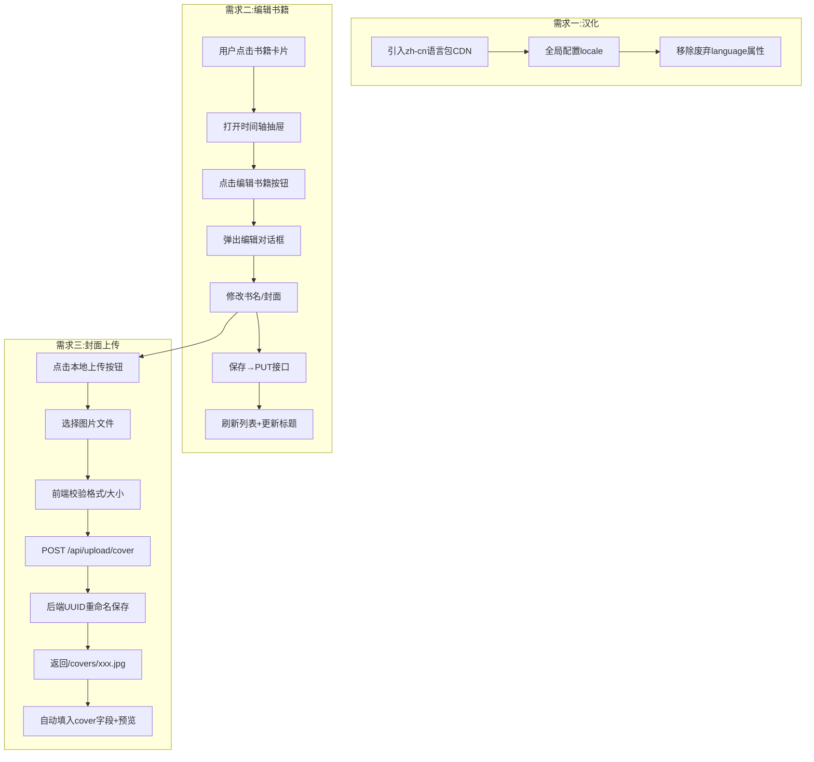

# 个人阅读档案系统 - 体验升级计划

## 概述

本文档针对三个需求制定详细实施计划：
1. 汉化 Element Plus 日期选择器
2. 支持书籍信息的后续编辑
3. 支持本地上传封面图片（数据持久化）

---

## 需求一：彻底汉化 Element Plus 日期选择器

### 当前问题

- [`index.html`](index.html:434) 中使用了已废弃的 `language="zh-cn"` 属性（Element Plus 3.x 已弃用此方式）
- 日期选择器显示英文月份（January, February...），而非中文（一月、二月...）

### 修改方案

#### 步骤 1：引入中文语言包 CDN

在 [`index.html`](index.html:13) 的 Element Plus 主脚本之后，新增一行引入中文语言包：

```html
<!-- 在 Element Plus 主脚本之后添加 -->
<script src="https://unpkg.com/element-plus/dist/locale/zh-cn.min.js"></script>
```

> **说明**：Element Plus 的 CDN 版本中，语言包位于 `element-plus/dist/locale/zh-cn.min.js`，加载后会暴露全局变量 `ElementPlusLocaleZhCn`。

#### 步骤 2：修改 Vue 初始化代码

在 [`index.html`](index.html:695) 中，将：

```javascript
app.use(ElementPlus);
```

修改为：

```javascript
app.use(ElementPlus, { locale: ElementPlusLocaleZhCn });
```

#### 步骤 3：移除废弃属性

在 [`index.html`](index.html:434) 中，移除 `language="zh-cn"` 属性，因为全局 locale 配置已生效。

---

## 需求二：支持书籍信息的后续编辑

### 后端修改（[`main.py`](main.py)）

#### 步骤 1：新增 `BookUpdate` Pydantic 模型

在 [`main.py`](main.py:90) 的 `BookCreate` 模型之后新增：

```python
class BookUpdate(BaseModel):
    """编辑书籍时，允许更新书名和封面"""
    title: Optional[str] = None
    cover: Optional[str] = None
```

#### 步骤 2：新增 `PUT /api/books/{book_id}` 接口

在 [`main.py`](main.py:182) 的 `get_book_logs` 路由之后新增：

```python
@app.put("/api/books/{book_id}")
def update_book(book_id: int, item: BookUpdate, db: Session = Depends(get_db)):
    """【服务员新】更新指定书籍的 title 和/或 cover"""
    book = db.query(Book).filter(Book.id == book_id).first()
    if not book:
        raise HTTPException(status_code=404, detail="找不到这本书")
    
    if item.title is not None:
        # 检查新书名是否与其他书冲突
        existing = db.query(Book).filter(Book.title == item.title, Book.id != book_id).first()
        if existing:
            raise HTTPException(status_code=400, detail="书名已存在，请使用其他名称")
        book.title = item.title
    
    if item.cover is not None:
        book.cover = item.cover
    
    db.commit()
    db.refresh(book)
    return {"message": "书籍信息更新成功！", "book_id": book.id}
```

### 前端修改（[`index.html`](index.html)）

#### 步骤 1：在时间轴抽屉顶部添加"编辑书籍"按钮

在 [`index.html`](index.html:450) 的 `<el-drawer>` 组件中，将标题改为自定义插槽，右侧添加编辑按钮：

```html
<el-drawer v-model="showTimeline" size="400px">
    <template #title>
        <span style="display: flex; align-items: center; gap: 12px;">
            <span>《{{ currentBookTitle }}》 档案纪要</span>
            <el-button type="primary" size="small" plain icon="Edit" @click="openEditDialog">
                编辑书籍
            </el-button>
        </span>
    </template>
    <!-- 原有内容不变 -->
    ...
</el-drawer>
```

#### 步骤 2：新增编辑书籍对话框

在时间轴抽屉之后，新增一个 `el-dialog` 用于编辑书籍信息（封面字段将整合需求三的上传功能）：

```html
<!-- 编辑书籍对话框 -->
<el-dialog v-model="showEditDialog" title="编辑书籍信息" width="450px" destroy-on-close>
    <el-form :model="editForm" label-width="80px" label-position="left">
        <el-form-item label="书名" required>
            <el-input v-model="editForm.title" placeholder="请输入书名"></el-input>
        </el-form-item>
        <el-form-item label="封面图片">
            <div style="display: flex; gap: 8px;">
                <el-input v-model="editForm.cover" placeholder="输入网络图片链接" style="flex: 1;"></el-input>
                <el-upload
                    :show-file-list="false"
                    :http-request="handleCoverUpload"
                    accept="image/*"
                    :before-upload="beforeCoverUpload">
                    <el-button icon="Upload" type="primary">本地上传</el-button>
                </el-upload>
            </div>
            <!-- 封面预览 -->
            
        </el-form-item>
    </el-form>
    <template #footer>
        <span class="dialog-footer">
            <el-button @click="showEditDialog = false" round>取消</el-button>
            <el-button type="primary" @click="handleEditSubmit" :loading="isEditing" round>保存修改</el-button>
        </span>
    </template>
</el-dialog>
```

#### 步骤 3：新增 Vue 响应式变量和方法

在 [`index.html`](index.html:498) 的 `setup()` 函数中新增：

**新增响应式变量：**
```javascript
const showEditDialog = ref(false);
const isEditing = ref(false);
const editingBookId = ref(null);
const editForm = reactive({
    title: '',
    cover: ''
});
```

**新增 `openEditDialog` 方法：**
```javascript
const openEditDialog = () => {
    const book = books.value.find(b => b.title === currentBookTitle.value);
    if (book) {
        editingBookId.value = book.id;
        editForm.title = book.title;
        editForm.cover = book.cover || '';
        showEditDialog.value = true;
    }
};
```

**新增 `handleEditSubmit` 方法：**
```javascript
const handleEditSubmit = async () => {
    if (!editForm.title) {
        ElMessage.warning('书名不能为空！');
        return;
    }
    isEditing.value = true;
    try {
        await axios.put(`${API_BASE}/books/${editingBookId.value}`, {
            title: editForm.title,
            cover: editForm.cover
        });
        ElMessage.success('书籍信息更新成功！');
        showEditDialog.value = false;
        await fetchBooks();
        currentBookTitle.value = editForm.title;
    } catch (error) {
        if (error.response?.data?.detail) {
            ElMessage.error(error.response.data.detail);
        } else {
            ElMessage.error('更新失败，请检查网络');
        }
    } finally {
        isEditing.value = false;
    }
};
```

**在 `return` 语句中暴露新变量和方法：**
```javascript
return {
    // ... 原有返回值
    showEditDialog, isEditing, editForm, openEditDialog, handleEditSubmit
};
```

---

## 需求三：支持本地上传封面图片

### 后端修改（[`main.py`](main.py)）

#### 步骤 1：引入新依赖

在 [`main.py`](main.py:1) 的导入区域新增：

```python
from fastapi import UploadFile, File
import uuid
import aiofiles
```

> **注意**：需要确保 `aiofiles` 已安装在 `requirements.txt` 中。如果未安装，需添加 `aiofiles` 到依赖。

#### 步骤 2：启动时自动创建 data/covers 目录

在 [`main.py`](main.py:16) 的 `os.makedirs('data', exist_ok=True)` 之后新增：

```python
os.makedirs('data/covers', exist_ok=True)
```

#### 步骤 3：挂载封面静态目录

在 [`main.py`](main.py:74) 的静态文件挂载之后新增：

```python
app.mount("/covers", StaticFiles(directory="data/covers"), name="covers")
```

#### 步骤 4：新增 POST /api/upload/cover 接口

在 [`main.py`](main.py) 中新增一个上传接口（建议放在 `delete_reading_log` 路由之前或之后）：

```python
@app.post("/api/upload/cover")
async def upload_cover(file: UploadFile = File(...)):
    """【服务员新】接收封面图片，保存到 data/covers 目录，返回可访问的 URL 路径"""
    # 生成唯一文件名，避免重名
    ext = os.path.splitext(file.filename)[1] if '.' in file.filename else '.jpg'
    unique_filename = f"{uuid.uuid4().hex}{ext}"
    file_path = os.path.join("data/covers", unique_filename)
    
    # 保存文件
    content = await file.read()
    with open(file_path, "wb") as f:
        f.write(content)
    
    # 返回可访问的路径
    return {"url": f"/covers/{unique_filename}"}
```

> **说明**：使用 `uuid.uuid4().hex` 生成唯一文件名，避免中文文件名或重名导致的路径问题。使用同步 `open` 写入而非 `aiofiles`，避免额外依赖。

### 前端修改（[`index.html`](index.html)）

#### 步骤 1：新增封面上传工具函数

在 Vue `setup()` 中新增 `handleCoverUpload` 和 `beforeCoverUpload` 方法（用于录入和编辑两个对话框）：

```javascript
// 封面上传前校验（限制 5MB，仅图片格式）
const beforeCoverUpload = (file) => {
    const isImage = file.type.startsWith('image/');
    const isLt5M = file.size / 1024 / 1024 < 5;
    if (!isImage) {
        ElMessage.error('只能上传图片文件！');
        return false;
    }
    if (!isLt5M) {
        ElMessage.error('图片大小不能超过 5MB！');
        return false;
    }
    return true;
};

// 自定义上传处理
const handleCoverUpload = async (options) => {
    const formData = new FormData();
    formData.append('file', options.file);
    try {
        const res = await axios.post(`${API_BASE}/upload/cover`, formData, {
            headers: { 'Content-Type': 'multipart/form-data' }
        });
        // 将返回的 URL 填入当前激活的表单
        if (showEditDialog.value) {
            editForm.cover = res.data.url;
        } else if (showAddDialog.value) {
            formData.cover = res.data.url;
        }
        ElMessage.success('封面上传成功！');
    } catch (error) {
        ElMessage.error('封面上传失败');
    }
};
```

#### 步骤 2：修改录入书籍对话框的封面字段

在 [`index.html`](index.html:437) 的录入对话框封面表单项中，增加本地上传按钮：

```html
<el-form-item label="封面图片">
    <div style="display: flex; gap: 8px;">
        <el-input v-model="formData.cover" placeholder="输入网络图片链接" style="flex: 1;"></el-input>
        <el-upload
            :show-file-list="false"
            :http-request="handleCoverUpload"
            accept="image/*"
            :before-upload="beforeCoverUpload">
            <el-button icon="Upload" type="primary">本地上传</el-button>
        </el-upload>
    </div>
    <!-- 封面预览 -->
    
</el-form-item>
```

#### 步骤 3：修改编辑书籍对话框的封面字段

同上（已在需求二步骤 2 中整合了上传按钮）。

#### 步骤 4：暴露新方法到 return

```javascript
return {
    // ... 原有返回值
    handleCoverUpload, beforeCoverUpload
};
```

---

## 文件修改清单

| 文件 | 修改类型 | 修改内容 |
|------|---------|---------|
| [`index.html`](index.html) | 新增 CDN 引用 | 引入 `element-plus/dist/locale/zh-cn.min.js` |
| [`index.html`](index.html) | 修改 | `app.use(ElementPlus)` → `app.use(ElementPlus, { locale: ElementPlusLocaleZhCn })` |
| [`index.html`](index.html) | 删除 | 移除 `language="zh-cn"` 属性 |
| [`index.html`](index.html) | 新增 | 编辑书籍对话框 HTML（含封面上传） |
| [`index.html`](index.html) | 修改 | 时间轴抽屉标题区域，添加"编辑书籍"按钮 |
| [`index.html`](index.html) | 修改 | 录入对话框封面字段，增加本地上传按钮和预览 |
| [`index.html`](index.html) | 新增 | Vue `setup()` 中新增编辑相关变量和方法 + 封面上传方法 |
| [`main.py`](main.py) | 修改 | 新增 `UploadFile`, `File`, `uuid` 导入 |
| [`main.py`](main.py) | 修改 | 新增 `data/covers` 目录创建逻辑 |
| [`main.py`](main.py) | 新增 | 挂载 `/covers` 静态目录 |
| [`main.py`](main.py) | 新增 | `BookUpdate` Pydantic 模型 |
| [`main.py`](main.py) | 新增 | `PUT /api/books/{book_id}` 路由 |
| [`main.py`](main.py) | 新增 | `POST /api/upload/cover` 路由 |

---

## 整体流程图



---

## 注意事项

1. **CDN 版本一致性**：确保引入的中文语言包版本与 Element Plus 主脚本版本一致。
2. **书名唯一性检查**：后端 `PUT` 接口中已包含书名冲突检查，避免修改后与其他书籍重名。
3. **封面上传安全**：前端限制仅图片格式且小于 5MB；后端使用 UUID 重命名避免路径穿越和安全问题。
4. **向后兼容**：所有新增代码均为增量修改，不影响现有的查重和日志追加功能。
5. **依赖更新**：如果 `requirements.txt` 中没有 `aiofiles`，建议使用同步 `open()` 写入（已在方案中采用），避免额外依赖。
